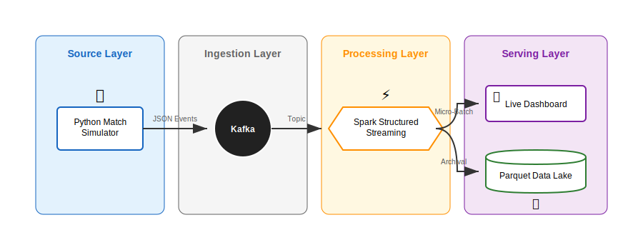
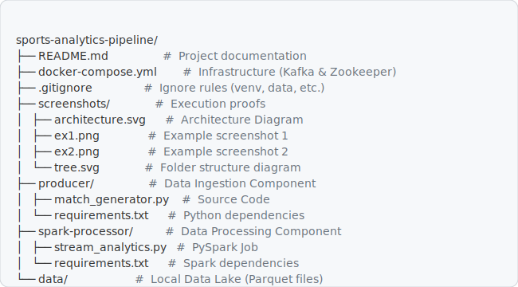
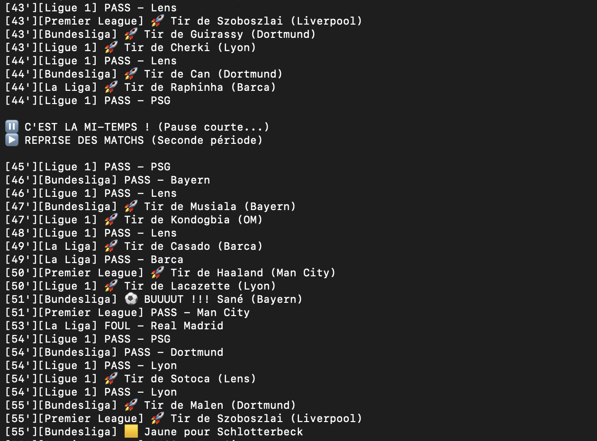
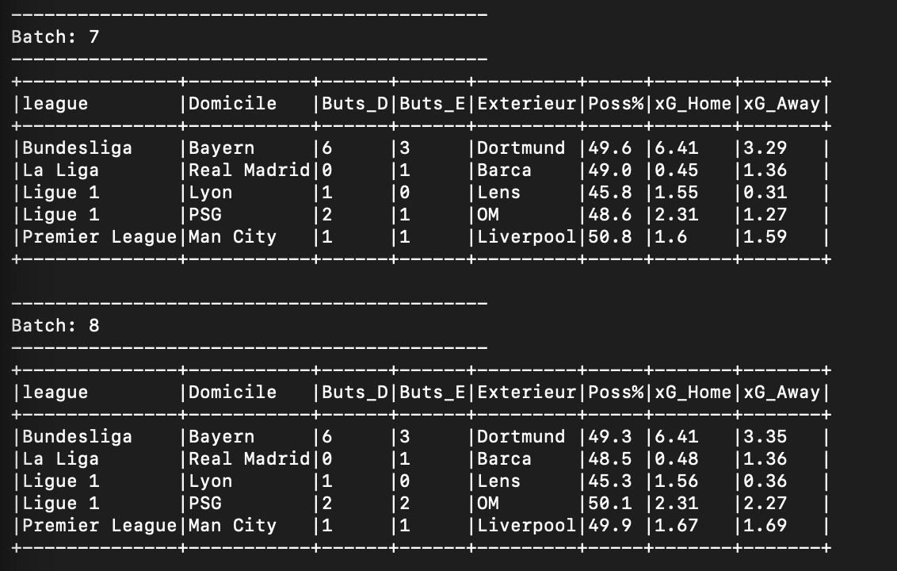
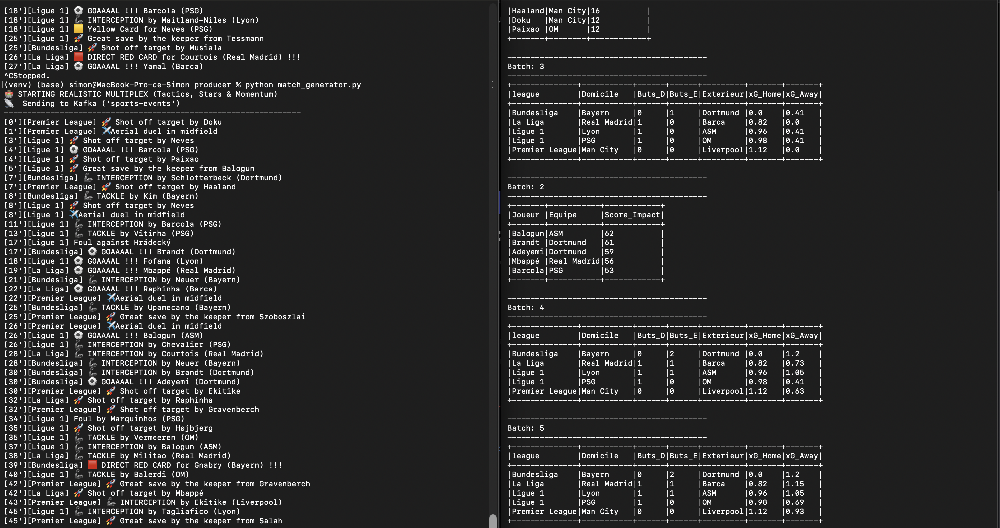

## ⚽ Real-Time Sports Analytics Pipeline

#### Description: 

A Big Data pipeline simulating a live sports multiplex. It ingests thousands of match events (goals, shots, passes) in real-time using Kafka, processes them with Spark Structured Streaming to calculate advanced metrics (Expected Goals, Possession %), and archives raw data for historical analysis.

#### Chosen Tools: 
- Apache Kafka (Ingestion) 
- Spark Structured Streaming (Processing).

#### 🏗️ Architecture & Minimal Working Example

This project implements a Minimal Working Example of a Kafka Producer-Consumer pipeline following the Kappa Architecture:

 

Source (Input): A Python script simulating 5 simultaneous European football matches with realistic probabilities based on player roles (Forward, Midfielder, etc.).

Ingestion: Apache Kafka acts as the high-throughput buffer.

Processing: Spark computes live statistics (Scoreboard, xG, Possession) using micro-batches.

Storage (Output): Raw data is simultaneously archived to local storage in Parquet format (Bronze Layer).

#### 🛠️ Folder Structure

The repository is organized to separate infrastructure, production, and processing logic:


 


#### 🚀 Installation & Usage

**1. Prerequisites**

Docker & Docker Compose

Python 3.9+

Java 11 or 17 (Required for Spark)

**2. Windows-Specific Configuration (Hadoop)**

On Windows, Spark requires the Hadoop utility ```winutils.exe``` and its associated DLLs to manage local file operations.

**Step 1 :** Create a root folder for Hadoop, e.g., ```C:\hadoop\```

**Step 2 :** Inside, create a subfolder named bin: ```C:\hadoop\bin\```

**Step 3 :** Download the version of winutils.exe and hadoop.dll corresponding to the Hadoop version used by Spark (here, Hadoop 3.3.x). Place these files inside C:\hadoop\bin.


**Step 4 :** Set the environment variables (execute these in your PowerShell session):

```$env:HADOOP_HOME="C:\hadoop"```
&
```$env:Path="$env:HADOOP_HOME\bin;$env:Path"``` 

**3. Start Infrastructure**

Launch the Kafka cluster using Docker from the root directory:

```docker-compose up -d```


Verify that containers are running with ```docker ps```.

**4. Setup Python Environment (Run once)**

It is recommended to use a virtual environment to manage dependencies for both the producer and the processor.

*4.1. Create virtual environment at the root*

```python -m venv venv```

*4.2. Activate the environment*

On Mac/Linux:

```source venv/bin/activate```

On Windows:

```.\venv\Scripts\Activate```

*4.3. Install ALL dependencies from requirements files*

```pip install -r producer/requirements.txt```
```pip install -r spark-processor/requirements.txt```


*4.4. Run the Pipeline*

**Terminal 1: Start the Match Generator (Producer)**

Ensure venv is activated

On Mac/Linux:
```source venv/bin/activate``` 

On Windows:
 ```.\venv\Scripts\Activate```

Run:
```cd producer```

Finally run:
```python match_generator.py```


**Output**: You will see logs of match events generated in real-time.

**Terminal 2: Start the Analytics Engine (Consumer)**

Ensure venv is activated

On Mac/Linux:
```source venv/bin/activate``` 

On Windows:
 ```.\venv\Scripts\Activate```

Windows Only: Set mandatory environment variables to handle Python paths and Unicode encoding (to avoid emoji/encoding crashes):

```$env:PYTHONIOENCODING="utf-8" ```
```$env:PYSPARK_PYTHON="[YOUR PATH TO THE FILE]\Big-Data-Final-Project-main\venv\Scripts\python.exe" ```

Run:
```cd spark-processor```

Submit the Spark job (Kafka package is handled automatically)

```spark-submit --packages org.apache.spark:spark-sql-kafka-0-10_2.13:3.5.0 stream_analytics.py```

#### 📸 Execution Proofs

**1. Producer Output (Logs)**

The producer simulates a realistic match flow, handling yellow cards and calculating xG (Expected Goals) on the fly.

 

**2. Live Dashboard (Spark Output)**

Spark aggregates data every 10 seconds to display the live scoreboard, possession percentage, and xG totals.

 

**3. Our pipeline in live**

This image shows the entire pipeline running in two terminals simultaneously, demonstrating the data flow from the producer (match events) to the consumer (live dashboard).

 


#### 🧠 Why These Tools?

**Why Apache Kafka?**

We selected Kafka for the ingestion layer because of its decoupling capabilities. In a real stadium context, sensors generates millions of events. Kafka ensures that if the analytics engine crashes, no match data is lost (Durability). It buffers the high-velocity data before processing.

**Why Spark Structured Streaming?**

Spark was chosen for its ability to handle stateful aggregations (counting goals over a window of time) and its unified API for both Batch and Streaming. We use it to compute complex metrics like "Possession %" which requires aggregating passes from both teams in a single match window.

**📝 My Setup Notes**

During the development, we encountered several specific Big Data challenges and documented my problem-solving process:

**🔴 Challenge 1: Docker Networking**

*Issue:* Our local Python script couldn't connect to Kafka inside Docker (NoBrokersAvailable).

*Root Cause:* Kafka inside Docker didn't know how to advertise itself to the host machine (localhost).

*Solution:* We learned about Kafka Listeners. We configured KAFKA_ADVERTISED_LISTENERS in docker-compose.yml to expose PLAINTEXT://localhost:9092 to my host machine while keeping an internal listener for Docker inter-communication.

**🔴 Challenge 2: Scala Version Mismatch**

*Issue:* Spark crashed with a java.lang.NoSuchMethodError related to wrapRefArray.

*Root Cause:* My local PySpark installation ran on Scala 2.13, but I was initially trying to load the spark-sql-kafka package compiled for Scala 2.12.

*Solution:* I analyzed the stack trace and updated the submit command to use the correct Maven coordinate: org.apache.spark:spark-sql-kafka-0-10_2.13:3.5.0.


#### 🌍 Fit into Big Data Ecosystem

This project demonstrates a standard Real-Time ETL Pipeline:

Ingest: Unstructured/Semi-structured data (JSON) enters via Kafka.

Process: Spark acts as the transformation layer, applying schema enforcement and business logic (xG calculation).

Serve:

Speed Layer: Console output simulates a live dashboard for immediate consumption.

Batch Layer: Writing to Parquet files creates a "Data Lake" (Bronze/Raw layer) allowing Data Scientists to retrain xG models later.